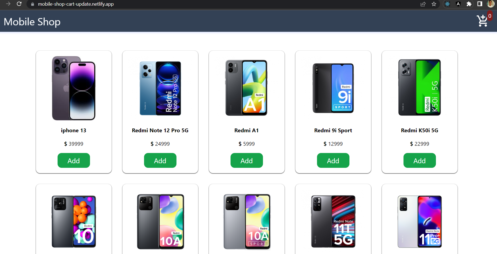
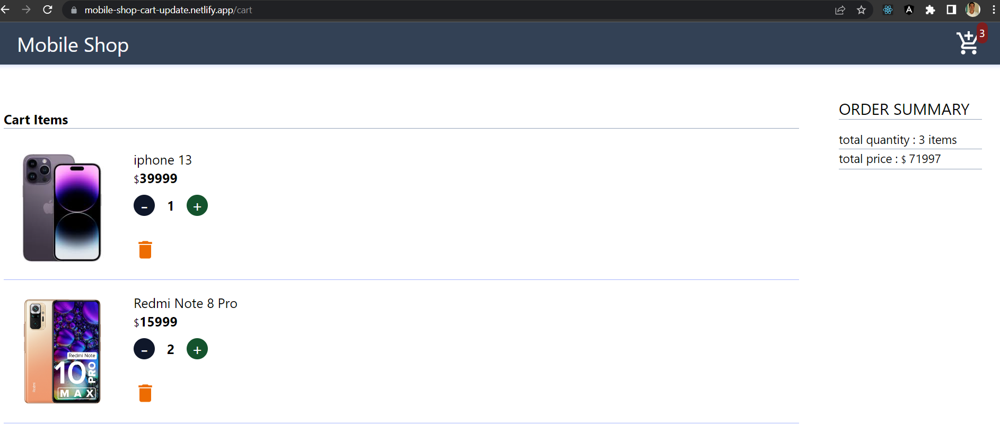

# Mobile Shop

## :page_facing_up: Description

- mobile shop application helps users to add items to cart

## 🚀 deployed on [netlify](https://app.netlify.com/)

- [https://mobile-shop-cart-update.netlify.app/](https://mobile-shop-cart-update.netlify.app/)

## 🛠 Installation and setup

1. Clone the repo to your local machine.
2. Install the required dependency for server using :

   ```javascript
   npm install
   ```

3. Start the dev server using :

   ```javascript
   npm run dev
   ```

## ⚙ Tools and Technologies used

- [React.js](https://react.dev/)
- [tailwind css](https://tailwindcss.com/)
- [material ui icons](https://mui.com/material-ui/getting-started/installation/)
- [react router dom](https://reactrouter.com/en/main)
- [redux toolkit](https://redux-toolkit.js.org/)
- [redux](https://redux.js.org/)
- [react redux](https://react-redux.js.org/)

## 🏎 Creating production build

1. Create a production ready react app using the command :

   ```javascript
   npm run build
   ```

## ✨ Features

Users can try the following features implemented

- [x] User can add the product to cart
- [x] User can click on the cart icon that opens the cart page
- [x] In the cart page user can see the cart summary and added items with quantity
- [x] User can decrease and increase the item quantity in the cart page
- [x] User can delete the item in the cart page

## Pages

- home page



- cart page


